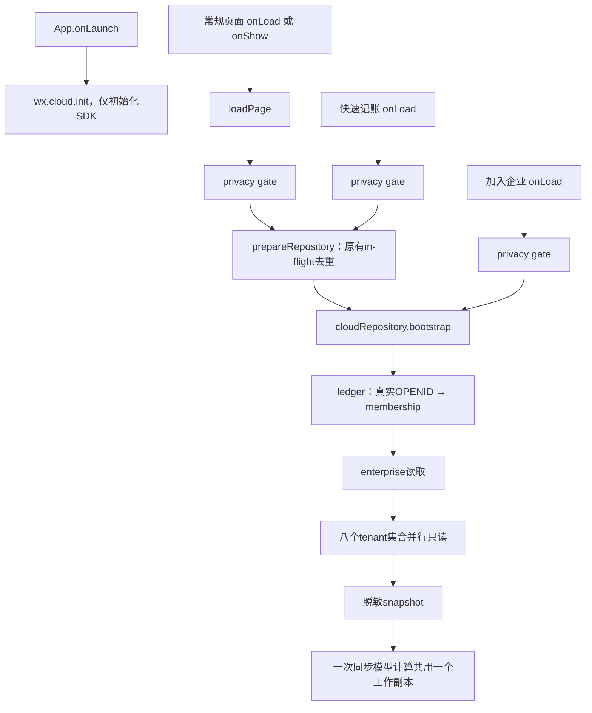

# 上线前性能优化完成报告

日期：2026-09-21。状态：**本地优化与验证完成；没有部署云函数、上传体验版、提交审核或修改正式数据库。**

## 1. 结论与问题排名

按本次代码级测量的影响排序，主要瓶颈是：

1. **首页与客户列表反复深拷贝整个企业数据。** 200 客户的首页需要 804 次 storage.read，客户页 801 次，累计复制约 2.25 / 2.24 GB。现一次同步页面计算只创建一个脱离原始缓存的工作副本，结束即释放。领域规则未改，写入仍全部走云函数。
2. **不参与显示的全量选项被重复送进视图。** 快速记账把 804 个产品的完整选项、标准子集和客户原始记录全部送进 setData；客户/历史还先送全量再送过滤结果。现逻辑数据保存在页面实例，仅发送显示字段和筛选结果。
3. **ExcelJS 拖慢全部云函数冷实例。** 原先存在 index → statement-export-file → statement-excel → exceljs 顶层加载链；现普通 action 和文件清理均不加载工作簿模块/ExcelJS。
4. **bootstrap 的八个独立集合查询串行等待。** 身份和企业读取后改为最多八路并发，只减少依赖等待；查询数量、条件、字段、上限和结果不变，事务内仍串行。
5. **长列表一次性发给视图。** 客户/历史首批 30 条、滚动追加；客户账本/当前及历史对账单的发货和收款按批次自动追加，每批等待 setData 回调再让出事件循环。汇总一次给全，所有明细最终完整显示。

以上排序不代表真机耗时排名；本次没有取得可靠的 iPhone timing。

## 2. 测量方法与原始基线

- 基线是本轮开始时的工作区，包含前几轮尚未提交的合法改动，**不是 git HEAD**。原始源码、git status/diff/stat、SHA-256 和初始测试日志保存在 `/private/tmp/ledger-performance-20260921-baseline/`。未覆盖已有改动。
- [阶段 1 瓶颈报告](性能基线与优化范围.md)在业务修改前完成。该报告中的约 8 秒包含每次 read 的额外字节统计；最终比较移除这一诊断开销，按同一脚本对原始源码重新采样，下面以最终三次中位数为准。
- 压力样本：200 客户、1,000 发货（每笔 2 行）、1,000 收款、400 账期、1,000 审计，企业快照 2,792,830 B；数据全部合成，未读取生产数据。标准产品使用现有 804 个产品选项，不改规格。客户价格和自定义产品在这一压力样本为空；另用非空价格/自定义产品做页面等价检查。
- 小样本：10 客户、40 发货；长账期：1 客户、1,000 发货，当前期 667 发货/667 收款、历史期 333 发货/333 收款。每个页面配置分别在三个独立进程中顺序测量。
- 云端测量执行真实入口但替换 SDK 为只读假数据库，单查询注入 3 ms 延迟。用于验证查询依赖与负载，**不是实际云端执行时间**。模块成本另在五个独立 Node 进程中顺序取中位数；SDK 的 require 成本也单独测量。
- setData 字节数为 JSON UTF-8 近似大小；页面 model 时间含真实仓储和页面计算、计数及模拟 setData 序列化，不含微信桥接、绘制、网络或真机帧率。

可复跑命令：

```bash
node scripts/benchmark-performance.js /private/tmp/ledger-performance-current.json
node scripts/benchmark-performance.js --pages-worker 200 1000 index,clients,quick-entry,history
node scripts/benchmark-performance.js --pages-worker 1 1000 client-ledger,statement,historical-statement
```

原始证据：[before.json](performance/before.json)、[after.json](performance/after.json)、[三轮测量](performance/repeated-measurements.json)、[21 场景等价检查](performance/view-equivalence.json)、[核心文件逐字节保护](performance/protected-files.json)、[WXML 扫描](performance/wxml-audit.json)。

## 3. 前后性能数据

| 指标 | 优化前 | 优化后 | 改善/说明 |
|---|---:|---:|---|
| 首页整库深拷贝次数（200客户） | 804 | 1 | 减少 803 次 |
| 客户页整库深拷贝次数（200客户） | 801 | 1 | 减少 800 次 |
| 首页 model / ms | 5,333.44 | 120.78 | 减少 97.7% |
| 客户页 model / ms | 5,292.74 | 97.36 | 减少 98.2% |
| 快速记账 model / ms | 29.27 | 8.53 | 减少 70.9% |
| 历史列表 model / ms | 21.62 | 13.68 | 减少 36.7% |
| 小样本首页 model / ms | 18.60 | 6.37 | 减少 65.8% |
| 小样本客户页 model / ms | 11.85 | 0.80 | 减少 93.3% |
| 长账期客户账本 model / ms | 35.34 | 16.46 | 减少 53.4% |
| 长账期当前对账单 model / ms | 32.68 | 13.52 | 减少 58.6% |
| 长账期历史对账单 model / ms | 8.98 | 8.74 | 差异很小，不宣称提速 |
| 云入口首次 require，SDK stub / ms | 60.26 | 3.89 | 减少 93.5% |
| bootstrap 模拟执行链，3 ms/查询 / ms | 35.94 | 12.53 | 减少 65.1%，非真实云延迟 |
| 普通入口载入模块数（含诊断模块，不含 SDK） | 479 | 16 | 移除重型依赖链 |
| bootstrap DB 查询数量，命中成员主键 | 10 | 10 | 查询内容不变 |
| bootstrap 最大并发 DB 读取 | 1 | 8 | membership、企业先完成 |
| bootstrap 返回 JSON（20客户/40发货样本） | 122,990 B | 122,990 B | 数据完全相同 |
| 快速记账初始化 payload（压力样本） | 430,732 B | 3,874 B | 减少 99.1% |
| 客户页初始化累计 payload | 175,294 B | 5,114 B | 完整逻辑数据保留；首批30条 |
| 历史页初始化累计 payload | 133,955 B | 10,086 B | 完整逻辑数据保留；首批30条 |
| 长当前对账单单次最大 payload | 335,890 B | 16,264 B | 分批发送，不丢明细 |
| 冷/热启动、首页首次可操作、实际跳转耗时 | 需真机测量 | 需真机测量 | 没有把 Node 时间当真机数据 |

长对账单是用更多小批次交换更低的单次负载：当前对账单完整初始化从 2 次 setData 变为 24 次（含原 onShow 状态更新），累计 payload 从 335,918 B 增至 356,821 B，约增加 6.2%；667 发货/667 收款全部保留。长客户账本从 1 次变为 23 次，最大单次 224,081 B → 11,041 B；历史对账单从 2 次变为 13 次，最大单次 168,713 B → 16,316 B。这不是虚拟列表，最终节点数和完整数据仍在；真机需要验证分批时的流畅度及最终内存。

## 4. ExcelJS 与云函数

普通 bootstrap、saveClient、postShipment（项目实际发货 action 名）、recordPayment、closeBillingPeriod 和读取 action 原先都会在实例加载时引入 ExcelJS。现在只有通过原有 membership 检查、执行 createStatementExcel 并完成导出范围/数据准备后，才按需 require 工作簿模块和 ExcelJS。cleanupStatementExportFile 只加载轻量文件/路径代码，不引入 ExcelJS。

新增运行时测试实际截获 Module._load：覆盖普通 action、清理、disabled 拒绝路径及有效 Excel 生成（实际生成 ZIP/xlsx 字节）。原三 Sheet、样式、冻结窗格、金额类型、历史产品快照测试未改。原权限检查、export action 白名单、源数据校验、错误返回包装和临时文件 finally 清理均保留。

依赖分层：高频必须的 access-control、membership/member-security、content-security、服务错误、脱敏、领域仓储保留入口加载；轻量导出读取/模型代码保留（毫秒级成本，无需扩大改动）；文件导出在对应 action 加载；重型 ExcelJS 只在生成工作簿时加载。

独立 require 中位数如下；库本身未升级，波动不计为收益：

| 模块 | 原先首次加载 | 当前首次加载 | 处理 |
|---|---:|---:|---|
| wx-server-sdk | 70.64 ms | 70.36 ms | 高频必需，保留 |
| ExcelJS | 59.04 ms | 57.96 ms | 成本移至首次导出 |
| 前端 repository-instance | 2.36 ms | 2.42 ms | 约2 ms，未做额外拆分 |

同进程再次 require 约 0.01 ms，属于 Node 模块缓存；不能用来代表小程序热启动。完整云冷启动还受 SDK、平台实例调度、网络和数据量影响。成功写 action 的正式云端耗时本轮未实测；其事务、二次 membership 检查、msgSecCheck、账务计算和持久化链均未改。

## 5. bootstrap 的真实调用链与刷新



| 调用场景 | 原先 | 当前 | 决策 |
|---|---:|---:|---|
| onLaunch 本身 | 0 | 0 | 不改 |
| 三个同时 prepareRepository | 1 个云请求 | 1 个云请求 | 原本已有去重；新增成功/失败清理测试 |
| 三个直接 repository.bootstrap | 3 个云请求 | 3 个云请求 | 直接接口无去重；普通页面不走此并发路径，未新增第二套缓存协议 |
| 首页→客户→客户账本→对账单 | 每进入一页 1 次 | 每进入一页 1 次 | 顺序访问重新检查身份与协作数据 |
| 首页→快速记账 | 1 次 | 1 次 | 不重复 onShow bootstrap |
| Tab 首页/客户/历史/我的再次显示 | 每页 1 次 | 每页 1 次 | 保留服务端身份检查 |
| 返回客户账本/客户/历史/产品等 onShow 页 | 1 次 | 1 次 | 有意刷新，防止其他成员写入后数据过期 |
| 对账单/快速记账返回后的 onShow | 0 次 | 0 次 | 保持原逻辑；对账单只复位打开图片状态 |
| 成员页 | bootstrap + 活跃邀请查询 | 相同 | 第二个查询是管理员邀请业务，不是重复 bootstrap |

没有发现普通页面一次初始化同时从 onLoad/onShow 重复发 bootstrap。本轮不删顺序请求、不引入 TTL snapshot、不缓存角色授权、不让通用 callback 执行两次。写操作后的快照安装和原刷新链保持原样；快照工作副本只存活于一次同步回调，成功、异常或跨 await 都释放。退出/disabled 后仍 resetRepository 并 reLaunch；新仓储在再次成功加载前不能读取。

已有数据的同一页面返回时不再显示全局“加载中”，改用导航栏加载提示，内容保留；首次加载仍等待云端。通用 loadPage 也服务于写入准备，因此没有套用会回调两遍的 stale-while-revalidate。写入仍用原“保存中”，Excel 仍保留原按钮状态及全局遮罩（防重复），图片生成仍保留原进度区域。没有增加动画或修改业务文案。

## 6. setData 全页面扫描

下面是 200 客户压力配置的首次初始化；“最大/累计”均为字节。除成员额外读取邀请外，常规页都只有一次 bootstrap。没有任何页面向 setData 传完整企业 snapshot。诊断在实际页面代码中截获 setData，不以静态调用点数冒充运行次数。

| 页面 | 次数 前→后 | 最大单次 前→后 / B | 初始化累计 前→后 / B |
|---|---:|---:|---:|
| 首页 | 1 → 1 | 1,765 → 1,765 | 1,765 → 1,765 |
| 客户 | 2 → 1 | 87,668 → 5,114 | 175,294 → 5,114 |
| 客户账本 | 1 → 1 | 1,770 → 1,770 | 1,770 → 1,770 |
| 对账单 | 2 → 2 | 2,811 → 2,811 | 2,839 → 2,839 |
| 历史 | 2 → 1 | 67,050 → 10,086 | 133,955 → 10,086 |
| 快速记账 | 1 → 1 | 430,732 → 3,874 | 430,732 → 3,874 |
| 发货详情 | 1 → 1 | 1,611 → 1,611 | 1,611 → 1,611 |
| 收款 | 1 → 1 | 544 → 544 | 544 → 544 |
| 产品 | 2 → 1 | 122,794 → 16,003 | 145,841 → 16,003 |
| 客户价格 | 2 → 1 | 89,385 → 360 | 89,398 → 360 |
| 成员 | 2 → 2 | 830 → 830 | 867 → 867 |
| 我的 | 1 → 1 | 165 → 165 | 165 → 165 |
| 操作记录 | 1 → 1 | 24,515 → 24,515 | 24,515 → 24,515 |
| 客户编辑 | 1 → 1 | 144 → 144 | 144 → 144 |
| 产品编辑 | 0 → 0 | 0 → 0 | 0 → 0 |
| 企业信息 | 1 → 1 | 80 → 80 | 80 → 80 |
| 负责人 | 1 → 1 | 1,486 → 1,486 | 1,486 → 1,486 |
| 帮助 | 0 → 0 | 0 → 0 | 0 → 0 |
| 数据设置 | 1 → 1 | 14 → 14 | 14 → 14 |
| 识别测试 | 0 → 0 | 0 → 0 | 0 → 0 |
| 未授权 | 1 → 1 | 76 → 76 | 76 → 76 |
| 加入企业（空邀请） | 1 → 1 | 85 → 85 | 85 → 85 |
| 隐私同意 | 2 → 2 | 101 → 101 | 163 → 163 |
| 账单图片预览 | 4 + Qs + Qp + P，前后不变 | Canvas/临时路径需真机测量 | 文件未改；未伪造 Canvas 运行数据 |

图片页公式来自调用链：Qs/Qp 为发货/收款读取批次数，P 为图片页数；包含准备、meta进度、逐批进度、逐页进度、结果与完成状态。该行是静态计数公式，不是实测值。

最大的原始页面是快速记账。现在 allClients/allHistories/allProducts/allPrices、完整产品索引和标准/自定义选项不再传入视图；客户、产品、价格行仅传其 WXML 显示字段。搜索仍读完整逻辑数组。搜索/筛选原来“先set状态、再set列表”的双次调用已合并。

原页面没有逐条循环 setData；新增长账单分批实现是在循环外构造最多 60 个数组路径，一次提交后再等待下一批。快速记账的价格/数量/运费输入仍按原逻辑重算行与金额，未做可能改变计价行为的缓存；普通文本输入仍仅更新对应字段。历史月份范围计算、账期排序和产品识别索引规则均未改。

## 7. 各重点页面与长列表

- 首页：通过统一加载上下文把全页 getter 的工作副本合并为一次；原欠款、最近五条、汇总和按钮不变。
- 客户：一次构建模型，完整搜索/负责人筛选后首批30条，标题显示完整过滤结果总数，滚动只append新增路径；已展开范围在刷新后保留。
- 客户账本：整库复制4→1；长发货/收款分批发送，总额、是否可收款/结清、删除预览和权限判断用完整数据；卸载/新模型取消旧批次。
- 快速记账：完整客户/产品选项留在逻辑层，picker只接收名称及实际可见候选，当前行数据和缺价锁定保持原样。
- 对账单（当前/历史）：完整 model 仍由原 getStatement 生成，长发货和收款分批发送。再次显示相同明细不重发数组，不收缩已展开内容；导出继续走原完整服务，绝不使用页面首批数据生成 Excel/分页图片。
- 历史：完整账期派生与月份交集计算保持不变，只把首次渲染限制为30条并合并筛选setData。
- 产品/客户价格：移除重复逻辑数组和未显示字段；产品原有150条上限、选择器80条规则不变。审计原有200条、成员及单笔发货明细保持原渲染方式，未为低频/较小列表加入额外分页协议。

| 长列表样本 | 首次重复元素估算 前→后 | 完整数据 |
|---|---:|---|
| 客户200条，每行约8个显式标签 | 1,600 → 240 | 滚动可看全部200条 |
| 历史200条，每行约13个显式标签 | 2,600 → 390 | 滚动可看全部200条 |
| 客户账本667发货+667收款 | 8,671 → 390 | 自动分批最终仍8,671 |
| 对账单667发货（各2行）+667收款 | 19,343 → 870 | 自动分批最终仍19,343 |

这些是 WXML 显式标签估算，排除文本节点并保守包含条件分支，不能当成微信真实节点计数。所有24处 wx:for 都有 key：业务实体使用id，记账行rowId，字符串列表*this；只有独立识别测试页用index，没有替换为不稳定假ID。没有大块 hidden DOM；弹层使用原wx:if，未重写结构或样式。

## 8. 分包评估

运行时源文件清单：24页，总量 385,427 → 390,651 B；JS 274,230 → 279,457 B，WXML 56,419 → 56,416 B，WXSS 51,726 B 不变。没有前端第三方依赖。最大源模块为 ledger-repository.js 60,934 B，其次快速记账 JS 28,378 B、order-parser.js 25,197 B。

**不分包。** 企业/成员/产品/价格/审计/图片等11个低频页自身文件合计约56 KB，拼接gzip估算约15 KB；共享仓储与产品规则仍留主包。分包会涉及路由/共享依赖和既有Tab依赖过滤边界，而本轮明确瓶颈在重复计算、桥接和云依赖。运行时代码增加约5.2 KB，低于引入分包结构的维护成本。这里是本地源码清单和压缩估算，**没有取得微信上传后实际主包大小**，应在下一次上传详情中核对；本轮按要求没有上传。

云函数 node_modules 与小程序主包分开：ExcelJS 文件总计约21.83 MB，为最大云依赖目录；@cloudbase约5.11 MB、xml2js约3.44 MB。lazy load 减少启动解析成本，不宣称减小云部署包体。

## 9. 行为、安全与数据确认

| 项目 | 本轮变化 | 证据 |
|---|---|---|
| 产品识别、价格、米/根/箱、特殊长度、运费与账务计算 | 无 | 原领域/识别/价格文件逐字节一致，全量业务测试通过 |
| admin/member、账期负责人、tenant/OPENID、disabled/invite、msgSecCheck | 无 | 原安全模块逐字节一致，入口/事务校验保留，新增disabled前置阻断测试 |
| 人工结清、历史成交/账期/修改审计 | 无 | 原仓储/快照逻辑未改；旧缺运费字段/legacy月份读取与原结果深比较 |
| 数据库集合、字段、索引、迁移、正式账务数据 | 无 | 未连生产数据，未执行任何数据库更改 |
| 隐私 gate、同意版本、脱敏和文件权限 | 无 | 对应源文件逐字节一致，权限/隐私专项通过 |
| Excel 三 Sheet、样式、金额类型、图片分页与临时清理 | 无 | Excel/paginator/renderer/client/service核心均未改，原专项全部通过 |
| UI风格/业务文案 | 无 | 仅客户数量绑定改为完整过滤计数；未改任何WXSS |
| 加载与列表出现时机 | 有，属于本轮性能范围 | 返回页轻量提示、分批显示；最终21个场景渲染字段/表单数据完全一致 |

不使用永久本地业务缓存。工作副本只在当前同步计算内共享，getter结果仍与内部数据隔离；新快照返回后下次读取立即使用它。列表实例数据与定时器随页面生命周期释放；云端写操作从未改走前端缓存。

## 10. 修改文件清单（仅本轮）

| 文件 | 目的 |
|---|---|
| cloudfunctions/ledger/index.js | 文件导出按action加载；授权后独立集合并行，事务路径保持串行 |
| cloudfunctions/ledger/services/statement-export-file.js | 工作簿/ExcelJS在真正生成时加载，cleanup不加载它 |
| services/cloud-repository.js | 同步只读工作副本共用，读API结果隔离、写API不变 |
| services/page-context.js | 在模型回调内开启同步读取范围；返回页用轻量加载提示 |
| services/progressive-list.js（新增） | 简单列表滚动追加、多段账单分批发送及取消旧任务 |
| pages/quick-entry/quick-entry.js | 产品/客户完整选项留逻辑层，同步初始化复用工作副本 |
| pages/clients/clients.js | 过滤/显示数据分离、单次setData、渐进列表 |
| pages/clients/clients.wxml | 数量从完整过滤计数读取，避免只显示首批数量 |
| pages/history/history.js | 隐藏筛选源留逻辑层、合并更新、渐进列表 |
| pages/products/products.js | 全量索引留逻辑层，合并过滤与状态更新 |
| pages/customer-prices/customer-prices.js | 价格/产品源留逻辑层，只发送可见字段 |
| pages/client-ledger/client-ledger.js | 分批发送长发货/收款；卸载取消 |
| pages/statement/statement.js | 分批发送当前/历史明细；卸载取消 |
| tests/quick-entry-page.test.js | 三处选项断言改读页面实例字段，原断言强度不变 |
| tests/performance-cloud.test.js（新增） | require拦截、授权前置、并行数量、事务顺序、真实xlsx生成 |
| tests/performance-client.test.js（新增） | 工作副本生命周期/隔离、已有去重、写后快照、disabled与setData保护 |
| tests/progressive-list.test.js（新增） | 完整搜索/顺序/计数、逐批追加、汇总完整、取消/卸载/返回保护 |
| scripts/benchmark-performance.js、scripts/performance-fixture.js（新增） | 可重复本地基准和不连生产的合成数据 |
| docs/性能基线与优化范围.md、本报告、docs/performance/（新增） | 基线、前后数据、可审计证据和本轮diff |
| PREFERENCES.md | 记录本轮实绩、边界与下一轮真机验收 |

没有改 package.json / lockfile、app配置、云权限配置、现有检查脚本或任何业务样式。本轮没有删除原有文件；完整本轮补丁另存 [performance-only.patch](performance/performance-only.patch)，初始状态另存 [initial-git-status.txt](performance/initial-git-status.txt)。

## 11. 自动验证

- 阶段1：230/230原测试通过，原生编译通过。
- 阶段2：14项云/Excel专项通过；全量235/235。
- 阶段3：22项页面/隐私/记账专项通过；全量240/240。
- 阶段4最终：19项长列表/页面/图片分页/Excel专项通过；最终全量245/245。
- `npm test`：**245/245通过，0失败、0跳过**。
- `npm run check`：**通过，24页面、92个JavaScript语法检查、24 WXML与25 WXSS微信原生编译**。
- `git diff --check`：**通过**。关键变更文件另行 `node --check` 通过。
- 原始源码与当前源码在独立进程、同一合成数据与固定Date.now下：**21个页面/交互场景逐字段一致**，包括完整展开列表、记账解析行、产品选择器、非空价格表/编辑表单。首次差异仅是临时rowId时间戳，固定测试时钟后原断言通过，没有删掉rowId断言。
- 仅修改已有快速记账测试的三处数据位置引用（从data迁到实例）；没有删测试、降阈值或改预期账务结果。新增15项稳定结构性回归；没有“必须小于50ms”之类阈值。

## 12. iPhone 16 Pro 验收清单

下一版体验版上传后，请使用普通真实使用量与专门的多数据测试企业各走一遍；不要为压测向正式客户增加账目。

1. 完全结束小程序后冷开、切后台再回来：记录首页从打开到可点“记一笔”的耗时；检查隐私未同意时仍先进入同意页。
2. 首页→客户→客户账本→对账单，再连续返回；首页/客户/历史/我的四个Tab来回切换10次，观察返回时是否保留内容、导航栏刷新能否结束。
3. 200客户/历史列表：首屏顺滑，滚动能看到末条，无重复或丢失；搜索末条客户手机号，切“我负责的”和历史月份，标题数量必须为完整结果。滚动后进入详情再返回，位置和展开范围不应收缩。
4. 长客户账本/当前与历史对账单：验证明细持续补齐、最终笔数正确、页底汇总不变，无长时间冻结。特别检查分批时滚动位置、完整加载后的内存和快速退出返回。
5. 快速记账：切客户、搜索标准/自定义产品、缺价补价、米/根/箱不一致锁定、确认特殊长度换算、运费及最终确认。修正已有发货与审计也走一遍。
6. 收款到0后选择“暂不结清”，随后再人工结清；管理员与成员/账期负责人分别验证按钮和服务端拒绝结果。
7. 图片生成、预览多页、保存/取消权限；Excel首次与第二次导出、打开/发送，核对三个Sheet和原样式。分批显示期间点击导出也必须获得完整账单。
8. 断网刷新再恢复、快速重复点击、另一成员改账后返回；管理员停用测试成员后，其刷新/写入应立即被拒绝并跳转。退出后重新进入或跨企业邀请不得显示旧企业内容。

需补录的真机指标：冷启动、热启动、首页首次可操作、各条导航/Tab/返回耗时与卡顿、长列表滚动帧率/内存、第一次Excel冷导出与分页图片生成时间。没有取得这些数据前，不把本地优化宣称为真机最终上线验收通过。

## 13. 部署影响与保留限制

| 项目 | 下一轮是否需要 | 本轮实际执行 |
|---|---|---|
| 重新部署ledger云函数 | 需要，才能应用lazy load与并行读取；仍要包含原Excel依赖 | 未部署 |
| 重新上传小程序体验版 | 需要，才能应用页面/仓储优化 | 未上传 |
| 修改云数据库集合/字段/索引/规则 | 不需要 | 未修改 |
| 修改隐私指引/同意版本 | 不需要 | 未修改 |
| 新增或升级依赖 | 不需要 | 未新增；exceljs仍4.4.0 |
| 提交微信审核 | 用户真机验收后另行决定 | 未提交 |

保留的容量边界：bootstrap仍读取完整快照、每集合最多1000条，未删历史/审计以换取性能；大企业网络传输与服务端响应大小仍需实际观察。长账单分批降低单次桥接负载，最终DOM仍完整；没有引入虚拟化或复杂缓存一致性协议。图片/Excel继续使用原按账期分页读取，保持1000+导出能力。
